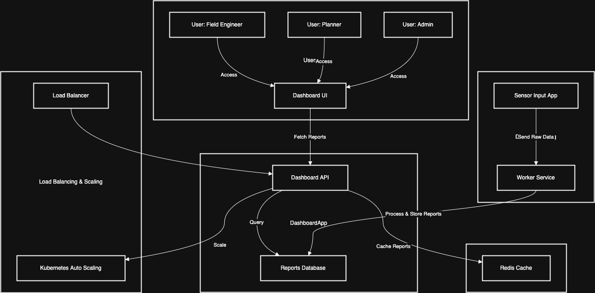

# **Dashboard App**

The **Dashboard App** is a key component of the **Smart Infrastructure Management System**, providing a user interface for monitoring, analyzing, and managing **infrastructure health**. It enables **field engineers, planners, and administrators** to track **structure performance**, review **maintenance history**, and receive **alerts on anomalies or failures**.

The **Dashboard App** does not interact directly with sensors but instead relies on **processed reports** generated by the **Worker Service** from raw sensor data. These reports are stored in the **Reports Database**, which provides **aggregated insights** into infrastructure conditions.

---

## **Diagram**

Link to draw.io diagram: [Dashboard App Diagram](https://viewer.diagrams.net/?tags=%7B%7D&lightbox=1&highlight=0000ff&edit=_blank&layers=1&nav=1&title=dashboard_app.drawio#Uhttps%3A%2F%2Fraw.githubusercontent.com%2Fjbunyadzade%2FSmartInfrastructureDesign%2Fdashboard-app%2Fdashboard_app%2Fdashboard_app.drawio)



---

## **Endpoints**

### `GET /dashboard/overview`

Retrieves a **summary of infrastructure status**, including key metrics and alerts.

#### **Request Input**

-   None

#### **Request Response**

-   `total_structures` (integer): Total number of monitored structures.
-   `active_alerts` (integer): Number of active alerts in the system.
-   `uptime` (float): System uptime in percentage.

#### **Example**

**Request:**  
`GET /dashboard/overview`

**Response:**

```json
{
    "total_structures": 5000,
    "active_alerts": 87,
    "uptime": 99.98
}
```

---

### `GET /dashboard/structures/:structure_id`

Retrieves **recent reports and metadata** for a specific structure.

#### **Request Input**

1. `structure_id` (UUID, required): Unique identifier of the structure.

#### **Request Response**

-   `structure_id` (UUID): Unique identifier of the structure.
-   `name` (string): Name of the structure.
-   `type` (string): Type of infrastructure (e.g., **bridge, road, pipeline**).
-   `region` (string): Geographical region of the structure.
-   `status` (string): Overall structure status (`"operational"`, `"warning"`, `"critical"`).
-   `last_report` (object): Most recent infrastructure report, including:
    -   `timestamp` (ISO 8601 string): Time of report generation.
    -   `metric` (string): Measured condition (e.g., `"stress_load"`, `"vibration"`).
    -   `aggregated_value` (float): Processed measurement value.

#### **Example**

**Request:**  
`GET /dashboard/structures/1f8d2b4d-3f25-4eaa-8fdc-7e5c9a8e938b`

**Response:**

```json
{
    "structure_id": "1f8d2b4d-3f25-4eaa-8fdc-7e5c9a8e938b",
    "name": "Golden Gate Bridge",
    "type": "bridge",
    "region": "San Francisco, CA",
    "status": "operational",
    "last_report": {
        "timestamp": "2025-01-27T12:34:56Z",
        "metric": "stress_load",
        "aggregated_value": 34.5
    }
}
```

---

### `GET /dashboard/alerts`

Retrieves **active alerts** for monitored structures.

#### **Request Input**

-   None

#### **Request Response**

-   `alerts` (array): List of active alerts, including:
    -   `alert_id` (UUID): Unique identifier for the alert.
    -   `structure_id` (UUID): The affected structure.
    -   `alert_type` (string): Type of alert (`"threshold_exceeded"`, `"structural_failure"`).
    -   `severity` (string): Severity (`"low"`, `"moderate"`, `"high"`, `"critical"`).
    -   `timestamp` (ISO 8601 string): When the alert was triggered.
    -   `resolved` (boolean): Whether the alert has been resolved.

#### **Example**

**Request:**  
`GET /dashboard/alerts`

**Response:**

```json
{
    "alerts": [
        {
            "alert_id": "alert_9876",
            "structure_id": "1f8d2b4d-3f25-4eaa-8fdc-7e5c9a8e938b",
            "alert_type": "threshold_exceeded",
            "severity": "high",
            "timestamp": "2025-01-27T12:45:00Z",
            "resolved": false
        }
    ]
}
```

---

## **Monitoring and Metrics**

1. **User Metrics**:

    - `active_users`: Current active dashboard users.
    - `session_duration`: Average session time per user.

2. **Performance Metrics**:

    - `dashboard_response_time`: API response time.
    - `api_request_rate`: Number of API requests per second.

3. **System Health Metrics**:
    - `dashboard_error_rate`: Percentage of failed requests.
    - `notification_latency`: Delay between an alert event and its visibility on the dashboard.

---

## **Performance Estimations**

1. **Expected Concurrent Users**: **Up to 10,000** concurrent users.
2. **Dashboard API Throughput**: **5,000 API requests per second**.
3. **Alert Processing Latency**: Alerts should appear within **500ms** of being generated.
4. **Dashboard Load Time**: Pages must load within **200ms**.

---

## **Data Processing Workflow**

1. **Infrastructure Reports Generation**:

    - The **Worker Service** processes raw sensor data into aggregated reports.
    - Reports are stored in the **Reports Database** for efficient retrieval.

2. **Dashboard API Querying**:

    - **Infrastructure reports, alerts, and maintenance logs** are retrieved from the **Reports Database**.
    - **No direct interaction with sensors** occurs.

3. **Alert Processing**:
    - The **Dashboard API** retrieves alerts from the **Alerts Table**.
    - Alerts remain active until marked as **resolved**.

---

## **Database Integration**

The **Dashboard App** interacts exclusively with the **Reports Database**, which stores:

-   **Structures (`structures`)** – Defines monitored infrastructure elements.
-   **Aggregated Reports (`reports`)** – Stores processed sensor data per structure.
-   **Maintenance Logs (`maintenance_logs`)** – Tracks past and upcoming repairs.
-   **Alerts (`alerts`)** – Stores active alerts for infrastructure failures.

**Optimization Strategies**:

-   **Indexing on `structure_id`** for fast lookups.
-   **Partitioning reports by `timestamp`** for efficient time-series queries.
-   **Caching recent reports in Redis** for rapid access.

---

## **Scalability Plan**

-   **Kubernetes-based auto-scaling** ensures high availability.
-   **Load balancers** distribute requests across multiple backend instances.
-   **CDN caching** optimizes delivery of static dashboard elements.

---

## Links

-   [Database Schema](./database_schema.md)
