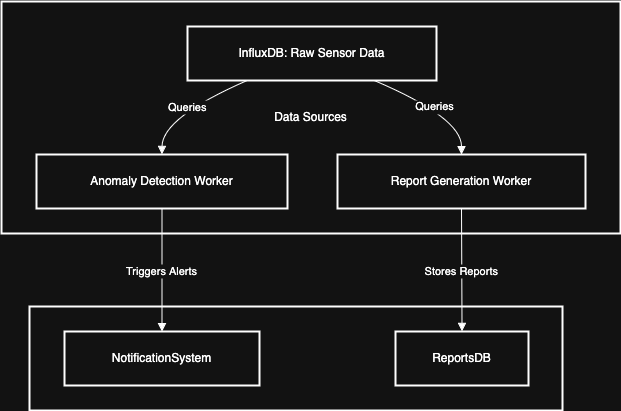

# **Data Churning Workers – System Design**

The **Data Churning Workers** process raw sensor data from **InfluxDB**, detect anomalies, and generate infrastructure reports. These workers operate asynchronously, periodically querying time-series data rather than consuming messages from a queue.

## **Core Responsibilities**

-   **Anomaly Detection:** Identify abnormal sensor behavior using statistical methods and ML models.
-   **Report Generation:** Aggregate infrastructure performance metrics for the Dashboard App.
-   **Database Optimization:** Store processed data efficiently in the Reports DB.
-   **Scheduled Query Execution:** Periodically query InfluxDB instead of relying on message queues.

## **Processing Workflow**

The workers operate in a **scheduled, pull-based** manner, periodically querying the **Time-Series Database (InfluxDB)**.

### **Data Sources**

-   **InfluxDB (Time-Series Database)** stores raw sensor data for real-time analytics.
-   **PostgreSQL (Reports DB)** stores aggregated and processed infrastructure reports.

### **Processing Logic**

1. Workers periodically query **InfluxDB** for the latest sensor readings.
2. Anomaly detection identifies abnormal patterns using historical trends.
3. Reports are generated by aggregating sensor data based on infrastructure type and region.
4. Processed data is stored in **PostgreSQL (Reports DB)**, and alerts are triggered when necessary.

## **Worker Execution Schedule**

| Worker Type              | Query Interval   | Purpose                                     |
| ------------------------ | ---------------- | ------------------------------------------- |
| Anomaly Detection Worker | Every 30 seconds | Detect abnormal sensor behavior             |
| Report Generation Worker | Every 5 minutes  | Generate summary reports for infrastructure |

## **Performance Considerations**

### **Expected Workload and Throughput**

| Task                      | Expected Frequency | Peak Load Scenario                      |
| ------------------------- | ------------------ | --------------------------------------- |
| Anomaly Checks            | 200K queries/day   | 10,000/sec during high-activity periods |
| Report Generation Queries | 50,000 reports/day | 5,000 reports/min at peak               |

### **Component Scaling**

| Component                 | Capacity          | Scaling Strategy                          |
| ------------------------- | ----------------- | ----------------------------------------- |
| InfluxDB (Time-Series DB) | 500,000 TPS       | Shard by region and time window           |
| Celery Workers            | 100,000 tasks/sec | Auto-scale based on query execution time  |
| PostgreSQL (Reports DB)   | 30,000 TPS        | Add read replicas for high-volume queries |
| Redis (Caching)           | ~1M keys/sec      | Cache frequently queried sensor data      |

## **Technology Stack**

| Component              | Technology Choice                                      |
| ---------------------- | ------------------------------------------------------ |
| Worker Framework       | Celery (Python)                                        |
| Time-Series Storage    | InfluxDB                                               |
| Processed Data Storage | PostgreSQL (Reports DB)                                |
| Anomaly Detection      | ML-based thresholding, moving averages, trend analysis |
| Caching                | Redis (for fast retrieval of recent sensor data)       |

## **Summary**

-   Workers **query InfluxDB instead of consuming messages from a queue**.
-   **Celery schedules queries** to execute at predefined intervals.
-   **InfluxDB handles raw sensor data**, while **PostgreSQL stores processed reports**.
-   **Auto-scaling ensures workers can handle peak loads efficiently**.

## **Diagram**

Link to draw.io diagram: [Data Churning Workers](https://viewer.diagrams.net/?tags=%7B%7D&lightbox=1&highlight=0000ff&edit=_blank&layers=1&nav=1&title=data_churners_diagram.drawio#Uhttps%3A%2F%2Fraw.githubusercontent.com%2Fjbunyadzade%2FSmartInfrastructureDesign%2Fmain%2Fdata_churner_fleet%2Fdata_churners_diagram.drawio)

