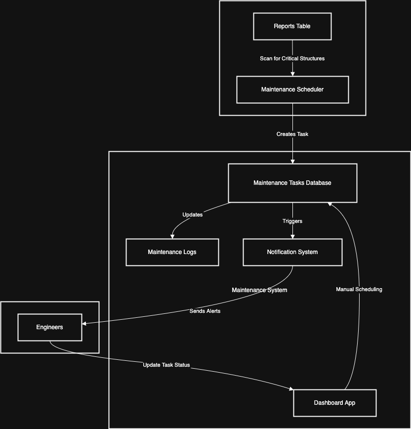

# **Maintenance Scheduler**

The **Maintenance Scheduler** is responsible for **automating maintenance task scheduling**, tracking **planned and ongoing repairs**, and ensuring **timely execution**. It integrates with the **Reports Database** and **Notification System** to trigger alerts and notify engineers.

---

## **Core Responsibilities**

-   **Automated Scheduling** – Generates **maintenance tasks** based on structure conditions.
-   **Manual Scheduling Support** – Engineers can schedule maintenance tasks.
-   **Task Tracking** – Monitors the **progress of ongoing maintenance**.
-   **Integration with Notifications** – Notifies engineers about scheduled and completed tasks.

---

## **Maintenance Scheduling Logic**

### **A. Automated Scheduling (Predictive Maintenance)**

1️. **Periodic Scan** – Queries `reports` table for **structures with "warning" or "critical" status**.  
2️. **Threshold-Based Triggers** – If an anomaly is found **multiple times**, a maintenance task is created.  
3️. **Prioritization** – Tasks are sorted by **severity, structure type, and location**.

### **B. Manual Scheduling (Engineer-Defined Tasks)**

1️. Engineers **manually create maintenance tasks** via the **Dashboard App**.  
2️. **Tasks are assigned to teams** based on expertise and availability.  
3️. **Notifications are sent** to responsible personnel.

---

## **Database Schema**

### **`maintenance_tasks` Table**

Tracks all **scheduled maintenance activities**.

| Column Name       | Data Type     | Description                                            |
| ----------------- | ------------- | ------------------------------------------------------ |
| `task_id`         | `UUID` (PK)   | Unique identifier for the maintenance task.            |
| `structure_id`    | `UUID` (FK)   | Structure requiring maintenance.                       |
| `region_id`       | `INTEGER`     | Region of the affected structure.                      |
| `created_by`      | `UUID` (FK)   | Engineer who created the task.                         |
| `task_type`       | `VARCHAR(50)` | Type (`inspection`, `repair`, `reinforcement`).        |
| `priority`        | `VARCHAR(20)` | Priority (`low`, `medium`, `high`, `critical`).        |
| `status`          | `VARCHAR(20)` | Task status (`scheduled`, `in_progress`, `completed`). |
| `scheduled_time`  | `TIMESTAMP`   | When the maintenance is planned.                       |
| `completion_time` | `TIMESTAMP`   | When the maintenance was completed.                    |
| `description`     | `TEXT`        | Notes about the task.                                  |

**Indexes:**

-   **Index on `structure_id`** for tracking maintenance per structure.
-   **Index on `region_id`** to optimize queries for engineers in a specific area.
-   **Index on `status`** for quick filtering of ongoing/completed tasks.

---

## **Workflow**

### **A. Automated Maintenance Scheduling**

1️. **Runs every 24 hours** – Scans structures with **critical/warning status**.  
2️. **Creates maintenance tasks** based on severity.  
3️. **Assigns tasks to engineers** (auto-assign based on workload).  
4️. **Triggers notifications** for assigned personnel.

### **B. Manual Maintenance Scheduling**

1️. **Engineer selects a structure** in the **Dashboard App**.  
2️. **Fills in task details** (date, priority, description).  
3️. **Task is created** and assigned to a **maintenance team**.  
4️. **Notifications are sent**.

### **C. Tracking & Completion**

1️. Engineers **update task status** as they work.  
2️. Upon completion, **task logs are stored** in the `maintenance_logs` table.  
3️. **Structure status is updated** in the `structures` table.

---

## **Integration with Notifications**

| **Event**                | **Trigger**                                 | **Recipient**          |
| ------------------------ | ------------------------------------------- | ---------------------- |
| **New Maintenance Task** | Task is created                             | Assigned engineers     |
| **Task Reminder**        | 1 hour before scheduled time                | Assigned engineers     |
| **Task Status Update**   | Status changes (`in_progress`, `completed`) | Relevant stakeholders  |
| **Overdue Task**         | Task not completed on time                  | Engineering supervisor |

---

## **Performance and Scaling**

| **Component**              | **Scaling Strategy**                                        |
| -------------------------- | ----------------------------------------------------------- |
| **Task Processing**        | Asynchronous queue to process automated tasks.              |
| **Database Indexing**      | Optimized queries for task retrieval.                       |
| **Worker Scaling**         | Auto-scale workers based on scheduling load.                |
| **Cache Frequent Queries** | Use Redis to store frequently accessed maintenance records. |

---

## **Summary**

-   **Automates maintenance scheduling based on structure health.**
-   **Engineers can manually schedule tasks via the Dashboard App.**
-   **Notifications keep all stakeholders updated.**
-   **Optimized indexing for fast retrieval of ongoing and completed tasks.**

## **Diagrams**

Link to draw.io diagram: [Maintenance Scheduler](link here)

