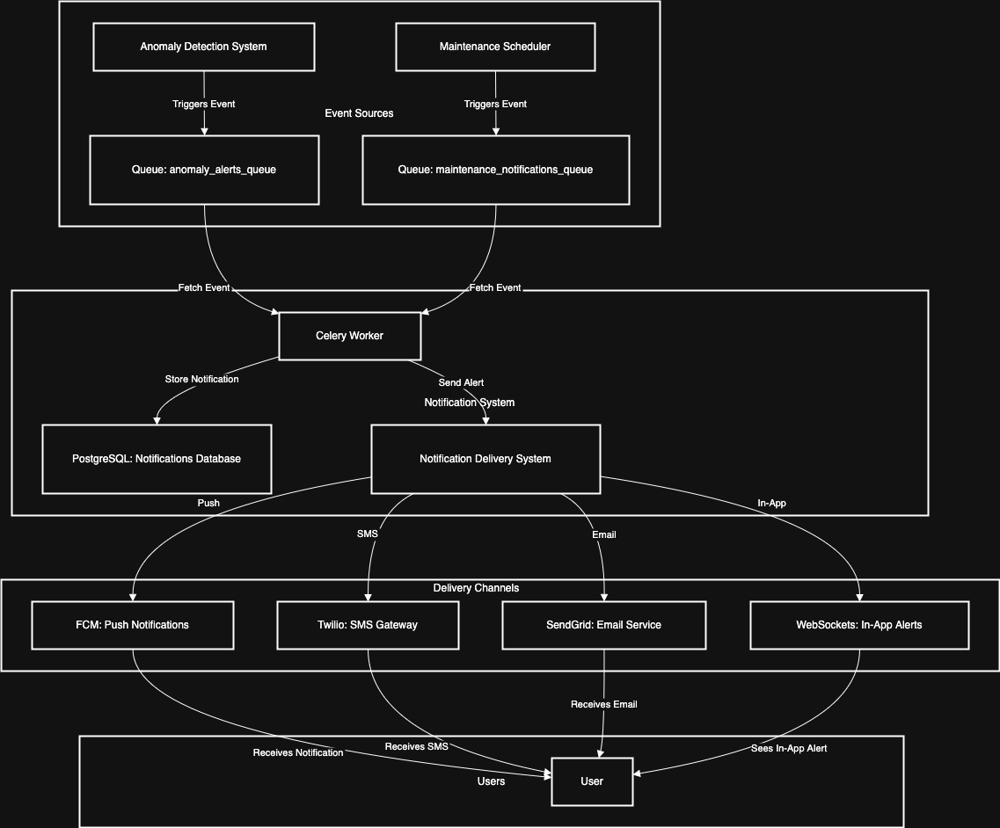

# **Notification System**

The **Notification System** is responsible for delivering **real-time alerts** and **maintenance updates** to relevant users. It ensures **timely, scalable, and reliable** delivery via multiple channels while prioritizing **critical notifications**.

---

## **Notification Types and Events**

The system listens for two major **event categories**, each processed through dedicated queues.

### **A. Anomaly Alerts (Real-Time Alerts)**

-   **Source**: **Anomaly Detection System**
-   **Event Queue**: `anomaly_alerts_queue` (RabbitMQ)
-   **Recipients**: **Field Engineers, Supervisors**

| **Event Type**       | **Trigger Condition**                                       | **Priority** | **Notification Channels**                      |
| -------------------- | ----------------------------------------------------------- | ------------ | ---------------------------------------------- |
| `threshold_exceeded` | Sensor metric surpasses predefined threshold                | **High**     | **Push (FCM), SMS (Twilio)**                   |
| `structural_failure` | Immediate risk detected (e.g., extreme stress on a bridge)  | **Critical** | **Push (FCM), SMS (Twilio), Email (SendGrid)** |
| `data_anomaly`       | Sensor data deviates significantly from historical patterns | **Medium**   | **Push (FCM), In-App (WebSockets)**            |

---

### **B. Maintenance Notifications (Task Updates)**

-   **Source**: **Maintenance Scheduler**
-   **Event Queue**: `maintenance_notifications_queue` (RabbitMQ)
-   **Recipients**: **Assigned Engineers, Admins**

| **Event Type**          | **Trigger Condition**                | **Priority** | **Notification Channels**                      |
| ----------------------- | ------------------------------------ | ------------ | ---------------------------------------------- |
| `maintenance_scheduled` | New maintenance task is created      | **Medium**   | **Email (SendGrid), In-App (WebSockets)**      |
| `task_reminder`         | Task starts in 1 hour                | **High**     | **Push (FCM), SMS (Twilio)**                   |
| `task_in_progress`      | Engineer marks task as "In Progress" | **Low**      | **In-App (WebSockets)**                        |
| `task_completed`        | Maintenance task is completed        | **Low**      | **In-App (WebSockets), Email (SendGrid)**      |
| `task_overdue`          | Task not completed by due time       | **High**     | **Push (FCM), SMS (Twilio), Email (SendGrid)** |

---

## **Message Flow & Processing**

The Notification System follows an **event-driven, queue-based** model with **RabbitMQ** for decoupling event producers from consumers.

### **A. Event Sources**

-   **Anomaly Detection System** → Publishes alerts to `anomaly_alerts_queue`.
-   **Maintenance Scheduler** → Publishes updates to `maintenance_notifications_queue`.

### **B. Processing Logic**

1️. **Notification Worker fetches events from the queue** (Celery).  
2️. **Applies filtering and deduplication** to prevent redundant alerts.  
3️. **Determines recipients** based on event type and urgency.  
4️. **Formats the message** appropriately for each delivery method.  
5️. **Sends the notification via the correct channel**.

### **C. Message Queues and Workers**

| **Queue Name**                    | **Message Source**       | **Consumers (Workers)**             |
| --------------------------------- | ------------------------ | ----------------------------------- |
| `anomaly_alerts_queue`            | Anomaly Detection System | **Celery Worker (High Priority)**   |
| `maintenance_notifications_queue` | Maintenance Scheduler    | **Celery Worker (Medium Priority)** |

---

## **Database Schema**

### **`notifications` Table**

Stores all sent notifications for **auditing, tracking, and retry handling**. Will be part of the [Reports Database](/dashboard_app/database_schema.md).

| Column Name       | Data Type     | Description                                       |
| ----------------- | ------------- | ------------------------------------------------- |
| `notification_id` | `UUID` (PK)   | Unique identifier.                                |
| `user_id`         | `UUID` (FK)   | Recipient of the notification.                    |
| `event_type`      | `VARCHAR(50)` | Type (`anomaly_alert`, `maintenance_update`).     |
| `severity`        | `VARCHAR(20)` | Severity (`low`, `moderate`, `high`, `critical`). |
| `delivery_method` | `VARCHAR(50)` | Channel (`email`, `SMS`, `push`, `in-app`).       |
| `status`          | `VARCHAR(20)` | Delivery status (`pending`, `sent`, `failed`).    |
| `timestamp`       | `TIMESTAMP`   | When the notification was sent.                   |

---

## **Performance Considerations**

### **A. Expected Workload and Throughput**

| **Event Type**                | **Expected Frequency**          | **Peak Load Scenario**                                      |
| ----------------------------- | ------------------------------- | ----------------------------------------------------------- |
| **Anomaly Alerts**            | **100,000 alerts/day**          | **5,000 alerts/min** during critical incidents.             |
| **Maintenance Notifications** | **50,000 updates/day**          | **2,500 updates/min** during scheduled maintenance periods. |
| **Total Notification Events** | **150,000/day (~1.7 TPS avg.)** | **Peak: 7,500 notifications/min (~125 TPS).**               |

### **B. Component Scaling**

| **Component**                | **Capacity**              | **Scaling Strategy**                         |
| ---------------------------- | ------------------------- | -------------------------------------------- |
| **RabbitMQ (Queues)**        | **75,000 messages/sec**   | Cluster if traffic > 50,000 msgs/min.        |
| **Celery Workers**           | **100,000 tasks/sec**     | Auto-scale based on queue backlog.           |
| **PostgreSQL (DB Logs)**     | **30,000 TPS**            | Add read replicas for high-volume queries.   |
| **Push Notifications (FCM)** | **10,000 req/sec**        | No changes needed.                           |
| **SMS (Twilio)**             | **100 req/sec (default)** | Add more sender numbers if rate-limited.     |
| **Email (SendGrid)**         | **120 emails/sec**        | Use multiple API keys if email volume grows. |

---

## **Summary**

-   **RabbitMQ handles priority-based message queues.**
-   **Celery workers process events asynchronously and retry failures.**
-   **FCM (Push), Twilio (SMS), and SendGrid (Email) ensure reliable delivery.**
-   **In-App alerts via WebSockets for real-time dashboard updates.**
-   **Auto-scaling applied to workers, queues, and databases.**

## **Diagram**

Link to draw.io diagram: [Notification System Diagram](https://viewer.diagrams.net/?tags=%7B%7D&lightbox=1&highlight=0000ff&edit=_blank&layers=1&nav=1&title=notification_system.drawio#Uhttps%3A%2F%2Fraw.githubusercontent.com%2Fjbunyadzade%2FSmartInfrastructureDesign%2Fmain%2Fnotifications%2Fnotification_system.drawio)

