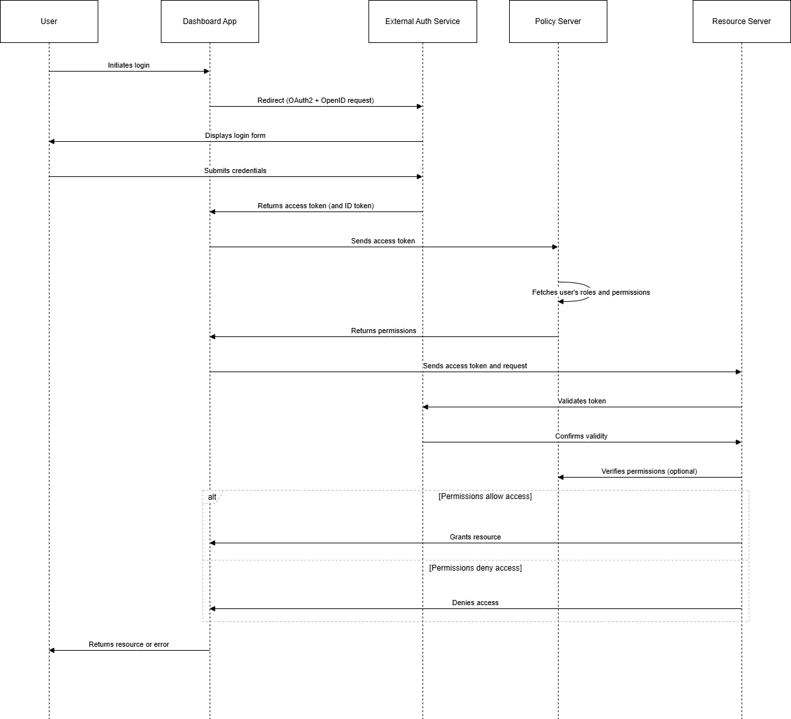

# Authentication and Authorization

**1.User Accesses the Application:**

The Resource Owner (typically a user) accesses the Application (client) wanting to use some protected resources.

**2.Application Redirects User to Authorization Server:**

The Application redirects the Resource Owner to the Authorization Server(via a URL) with an authorization request, including the `client_id`, `redirect_uri`, `response_type=code`, and `scope`.

The URL contains details like: 
- `client_id`: Identifies the application. 
- `redirect_uri`: A URL in your app where the user will be redirected after successful authentication and authorization.
- `response_type=code`: Indicates that the app wants an authorization code.
- `scope`: Defines the level of access being requested (e.g., profile, email, etc.).

**3.User Authenticates and Authorizes Access :**

- The user logs in by entering their credentials (e.g., username, password) on the Authorization Server.
- Once authenticated, the server asks the user to grant permission for the requested scopes. For example:
  - Access to their profile information.
  - Access to their email address.
What Happens Here?
- If the user approves, the Authorization Server moves to the next step.
- If the user denies, the flow ends, and the application does not receive any token.

**4.Authorization Server Redirects Back to Application with Authorization Code:**

After successful authentication and authorization, the Authorization Server redirects the user back to the Application's `redirect_uri` with an `authorization_code`. The Authorization Code is a temporary code that the client can use to exchange for an Access Token. This code is short-lived and can only be used once.

**5.Application Exchanges Authorization Code for Access Token:**

The Application sends the `authorization_code`, `client_id`, `client_secret`, and `redirect_uri` to the Authorization Server in a back-channel request to obtain an Access Token.
- The `authorization_code` received earlier.
- The `client_id` and `client_secret` to authenticate the client.
- The original `redirect_uri` for verification.

**6.Authorization Server Issues Access Token:**

The Authorization Server validates the Authorization Code and returns an Access Token (and optionally a Refresh Token) to the Application.

**7.Request Resource with Access Token:**

The Application sends the Access Token to the Resource Server to request protected resources.

**8.Return Resource:**

The Resource Server validates the Access Token and, if valid, returns the requested resource to the Application.

**Diagram**

Link to draw.io diagram: [OAuth2 Diagram](https://viewer.diagrams.net/?tags=%7B%7D&lightbox=1&highlight=0000ff&edit=_blank&layers=1&nav=1&title=oauth2.drawio#R%3Cmxfile%3E%3Cdiagram%20name%3D%22Page-1%22%20id%3D%22A6TEADBUKVytIuzO8XLI%22%3E7ZtRc5s4EIB%2Fjed6D80IBBge4zjJZa43zdRtr3dvCiixpjKiQo7t%2FvqTQGCEbIfMxS52kswkZpEE7H7aXa3wAF7MltccZdO%2FWILpwAXJcgDHA9d1gA%2FkPyVZlZL3MByGpeiBk0Q3Wwsm5Ceu%2BmrpnCQ4NxoKxqggmSmMWZriWBgyxDlbmM3uGTWvmqEHbAkmMaK29G%2BSiGkpDasHU%2FI%2FMHmYVld2gD4zQ1VjLcinKGGLhgheDuAFZ0yUn2bLC0yV%2Biq9lP2utpytb4zjVHTpkF9%2F%2Bfzzz5vlJWdX0cXNv06Wi%2FcQlsM8IjrXTzzGMckJSwfwXJ44p1TetHs1xulKP4dYVcqJ5%2FwRq%2BGdARzlAnFxrlQuBSlLZZsRTpNKckdZ%2FF2JlkR8k8fgLIL68B91WLQWfPVND1ccFGfOhpE85myeJsXFVFP74bU%2BcGLYU6viGrMZluPJBhxTJMijaV6kKXmo2%2Bmu8u7RqtEgYyQVeWPkWyWQDTTy0dAvR1xVPIS%2BaZWnOgAvanaQH8p72Nw98B2jexS5Z0EA6p%2FW80kTPWChxzAu0tDRWlQQ9AyaPN%2Bi6RMWc55K2Wf2HafF7JV%2FvuSYvyhNThOlM%2BjsoCk4GpgcMIxMOIIg2kmT3QNG4Bk4%2BeGw1R26Z95hGQoshibS8A2CFkR6Vhd8wj%2FmOBcv65QMjIJhEyNwBiKTJOAcDUrSU%2Bzk4ukOvus%2FAyQv8tsgBWdOaD5VzuY8xnsjyYkcC6WNjkdG5kx9nM%2FoB3KPKSkwyTAn8hZkezimWny7lo0WUyLwJEOx6rqQ%2BY%2BUySxEINmOa%2FwSzrLPxXzRfMSMUpTl5K64tpJwLIHNpeE%2F4bzMfpSUzYW63kWd1ShhxriQklxwRAq8MMrFQs0BOErx4lIiNqmeaihRDH7MVXIxwvWJWlQE9%2Fo8vWON3utG7kWr0ZYBHjEXROZMW7rqGdnsC4wG1RwyWwzHagKXOgn8XZNLXR8vd06v6qwHDC49H2rBYp3dOVV2NzUzu5YjbE5Kg93ng%2BraWRjKp3cMceX4zrPsjdnXyyxsBeWeMGuvHC6XkrJUqRScz4sYPcH8kUjY3uh9tfQOQdCB3iA4ML3eltQAjJFAcsxbRkmsHmM8eqP39dIbuW4ffe%2BmdXaZTWun%2B5blvmZqHbdir1%2FY2kt7RO0FfAPUK45mitJEZsP1mr5Y62J%2B%2BYjVkreExkJQ4sO%2BS7Io48WocFT8yjP107qqXaUPCF5A716rGue7IbTUHsLIVrsL3L1pfWhpfeCP5ByfkVzVeXN11bLKC1Ac4zwf%2BGPLKFIDwlKrLqjcE0pbIkTJQyoPY5yWfqSaPOf6xIwkiRp7o4OxTfEEUN1zaXsahGCjPfZmjvBpcyRFsX2HNaopop24MT02KbStfcGUlKI7TG9ZTkRR7reN9aHVoDaaZd7t020PtqxL5UG3yQX3ZsvIsuVNKpWFBFZmpOyBpJbt2ra4Y0KwmRHAZMwzg1UVmOC4DkJ1wNEB1ihDbihxbnVvOm%2FoUEcTlYPd3lJ7sV9c7YRea8UcwB2bKi9Vb3SrrT8jLUsIV7mNC959VItidX7gSmuAjxlOb8aFLopC9u%2BnQIrbmRTYC1IC2EqUAn1jeybFrkyPSZ5RtGr4DXDP%2BOwUoICdoejHZonvtKAYan%2ByZyjsKvBkfjcj6lZBzLHMCmRoofkpINE9ovTDT%2FiOmdl7oZ7Ce0bCLrKWG%2Br5Oj1UW%2Brlxug7VOyTFkGlkJ1ESOnuPfqRfASwlXyE%2Fo6d05dDxa5oqn3zTaAcPxPd0wyvF0wMYWgyEYGDJKR2nfAKi3harE7mOea%2FqQ%2Bc0UJQeo%2BsuRJtkWK8WrHBpB3fhehgYO%2FIDOwAr23hwEgku%2FQ4TOppF%2BHWIWWX8Y%2FQTXSnqB%2BhY%2Bi16ofgMImnXSHcFjq0k%2BBb3r06Qka6hxK%2FF4yErTf8fOcwmahdtvyKKEl0qetkMgu%2FMw79WJjIMBK0eDhMummXPi9Yek%2F4LC%2BlJCHCfmP8CInovv7oh4OQRECTCPcgyaZjVz%2B%2FYk7uCbYyC%2FCOZWpLAdGTWKF29xk9SVbrnd%2BakOAQqWdVQ2kQcs1Rcavyiav3F14TD%2F1IO8PQNXGAgXcIHOx65xinpbuo8s43GH45DF5wiHzC2VXpXDsHwLhSkbQPPwU4ui8%2B%2BrEzAtuBw3f%2FV2ohD9dfgCybr79ICi%2F%2FAw%3D%3D%3C%2Fdiagram%3E%3C%2Fmxfile%3E)

