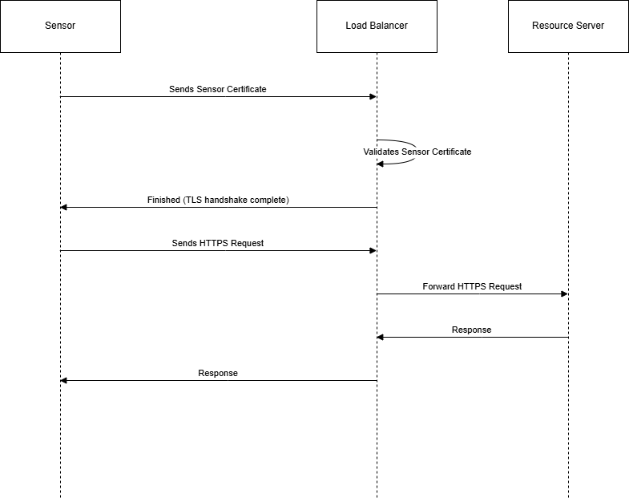

# Authentication and Authorization of Sensor

This sequence diagram represents a communication process involving a **Sensor**, a **Load Balancer**, and a **Resource Server**. The process primarily focuses on secure communication through a TLS handshake and subsequent HTTPS requests.

**Transport Layer Security (TLS)** is a cryptographic protocol that ensures secure communication over a network. It provides:
- **Encryption** – Protects data from being intercepted.
- **Authentication** – Verifies the identity of parties involved.
- **Data Integrity** – Ensures data is not altered during transmission.

---

## **Actors in the Diagram**
1. **Sensor** – The source of the communication, initiating secure transmission.
2. **Load Balancer** – Handles certificate validation and forwards HTTPS requests.
3. **Resource Server** – The destination server processing the requests.

---

## **Step-by-Step Process**

### **1. Sensor Sends Sensor Certificate**
- The **Sensor** initiates a **TLS handshake** by sending its **certificate** to the **Load Balancer**.
- This step is crucial for establishing a secure connection.

### **2. Load Balancer Validates Sensor Certificate**
- The **Load Balancer** checks the received **Sensor Certificate** to confirm its authenticity.
- If the certificate is valid, the connection continues.

### **3. TLS Handshake Completion**
- Once the certificate validation is successful, the **TLS handshake** is **finished**.
- The connection is now **encrypted** and ready for secure communication.

### **4. Sensor Sends HTTPS Request**
- After securing the connection, the **Sensor** sends an **HTTPS request** to the **Load Balancer**.
- This request could be for **data transmission**, **authentication**, or other purposes.

### **5. Load Balancer Forwards HTTPS Request**
- The **Load Balancer** forwards the **HTTPS request** to the **Resource Server**.
- This step ensures that traffic is balanced across multiple servers if necessary.

### **6. Resource Server Processes the Request and Sends a Response**
- The **Resource Server** processes the request and **sends a response** back to the **Load Balancer**.

### **7. Load Balancer Sends Response to Sensor**
- Finally, the **Load Balancer** forwards the **response** back to the **Sensor**.
- The communication cycle is now complete.

---

## **Summary**
- The **Sensor** initiates communication with a **secure TLS handshake**.
- The **Load Balancer** ensures **authentication** and forwards requests.
- The **Resource Server** processes requests and sends responses.
- This sequence ensures a **secure**, **validated**, and **load-balanced** transmission between the **Sensor** and **Resource Server**.
---

## **Diagram**

Link to draw.io diagram: [Sensor Auth Diagram](https://viewer.diagrams.net/?tags=%7B%7D&lightbox=1&highlight=0000ff&edit=_blank&layers=1&nav=1&title=sensor_auth.drawio#R%3Cmxfile%3E%3Cdiagram%20name%3D%22Page-1%22%20id%3D%22mMZeZgjikk1Z3pZBnvqS%22%3E7ZnbbuIwEIafBmn3olXOgUugJ62o1C1o93LlEpdYNXHqOAT26XdMnITEAQotq0qlN3V%2Bz4wdzxd7Ejr2cL685SgO71mAaccygmXHvupYlmmbNvyTyipXLkzX8XNpxkmgzCphTP5iJRpKTUmAk5qhYIwKEtfFKYsiPBU1DXHOsrrZM6P1UWM0w5owniKqq79JIMJc7bpGpd9hMguLkU1D9cxRYayEJEQByzYk%2B7pjDzljIm%2FNl0NM5fIV65L73WzpLSfGcSTe4vCD%2F1k594Iv7n52aW%2F0yN3%2B6KKnsrFANFV3PMZRwrias1gVCwHTj2UzndMRecaURHA1iDEncywwhx6q5IdKG2QhEXgco6l0zQAS0CBVAoGd9DHhOuAsniA%2Bw%2FI2jLUBpShOyNN6bKlwPE15Qhb4ESc5IlJlqZDjDcvUSzFmXICSCA5jSBGjRGQ4geYgwtl1AOkt7sofdCzvNZUZGOCyo5Q6dn%2Bjnz6xDe%2FKyBo2jLYEWGAuCIC1xRVucIGDmq9RM%2BAsjQLNwr%2BClloTz10HbWKhSJHj4%2BWGpDC5xQyyxVdgonoLYtVDa9kF01n1BJjFExBu0O8Vnkg9dbMydgUmNBSbh3Da1TgdMQSLYQwQRdEUn4H9wsA6pvv5iO1pxAILLOVAlmWMMSzemdkvzKznOp%2BOWdOw28qBIFkTm5cFxlAu8TMsssAav8Xy9ymZRSA9MSHYvJZ4YKWe5CKh9lWZvDJRCkyVlPwK5tOXhZ0MT9n0ZVc65LA7k8ExRQKQr9eNLeu6doVx0WrDIGZAf7IR%2BUEKVY5tw6zn2KnXaNDIQ7a795xLyzXKP8tuD1ZOJ99dVJDNSrAR1%2Bn2Lt09scR6r9BirbEq1%2B89pDkaab8QJQFQ9WbaSkjMdizq3HxWSFynCYnv7Eyf5uAaTuftVMns17BqH%2F0oqnbELSb5%2FwhzNcJuSESSUG7vxrfJaCz3VQS7W4he8PoVch5TOFK%2Fn7e1fdta4%2Bhy3e6BALrtAQ6Gbs8WqcU9OXTe1gP0bjJ5kMg94tdUVkpnyA47Oz3T%2Brizswj2EWenFuvkkOkfbW4YzxAPzpgdiplndhvZ9LyPO0yLYAdj5ltdDbNmrJNjpn9zgTfDGF77zoX%2FPqqsxublH1T4t2Tff0%2Bxv4NQLe7JqWr9LnKm6pi6y%2FcPLfybVB1b7O85XrW4R1MFl9VPJLl59VOTff0P%3C%2Fdiagram%3E%3C%2Fmxfile%3E)

