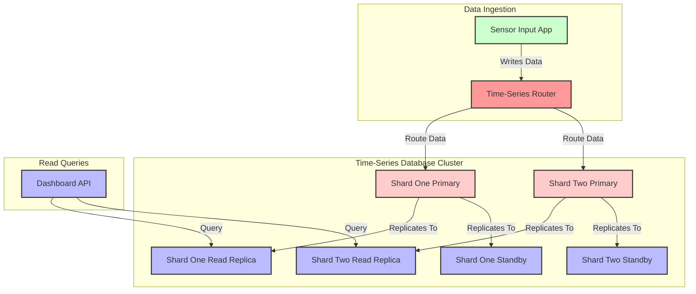

# **Sensor Input Time-Series Database Design**

The **Sensor Input Time-Series Database (TSDB)** is designed to handle **high-velocity, append-only data** from IoT sensors. Unlike the **Reports Database (PostgreSQL)**, which aggregates processed data, the **Time-Series DB** must store **raw, high-frequency sensor readings** with minimal latency.

---

## **1. Choosing the Right Time-Series Database**

For a **high-ingestion, low-latency** workload, the ideal TSDB should:
✅ Handle **millions of writes per second**.  
✅ Support **efficient queries on time-based data**.  
✅ Scale **horizontally** as sensor count increases.

🔹 **Recommended TSDBs:**

| **Database**                           | **Best For**                               | **Max Write TPS** | **Replication Support** |
| -------------------------------------- | ------------------------------------------ | ----------------- | ----------------------- |
| **TimescaleDB** (PostgreSQL extension) | SQL compatibility, PostgreSQL integration  | ~100,000          | Yes (PostgreSQL-native) |
| **InfluxDB**                           | Native time-series queries, high ingestion | ~500,000          | Yes (Clustered mode)    |
| **VictoriaMetrics**                    | Cloud-native, multi-tenant                 | ~1,000,000+       | Yes                     |
| **ClickHouse**                         | Fast analytical queries                    | ~500,000          | Yes                     |

🚀 **Choice: InfluxDB**  
✅ **Fast writes (~500K TPS per node)**  
✅ **Optimized for IoT sensor workloads**  
✅ **Efficient time-based queries**  
✅ **Retention policies** reduce storage costs

---

## **2. Database Schema**

### **`sensor_readings` Table (Main Time-Series Storage)**

| Column Name | Data Type        | Description                                            |
| ----------- | ---------------- | ------------------------------------------------------ |
| `timestamp` | `TIMESTAMP` (PK) | When the reading was recorded.                         |
| `sensor_id` | `STRING` (Tag)   | Unique identifier for the sensor.                      |
| `metric`    | `STRING` (Tag)   | The type of measurement (e.g., temperature, pressure). |
| `value`     | `FLOAT`          | The actual sensor reading.                             |
| `region_id` | `INTEGER` (Tag)  | The region where the sensor is deployed.               |

🔹 **Why This Structure?**

-   **Tags (`sensor_id`, `metric`, `region_id`) are indexed for fast lookups.**
-   **`timestamp` is the primary key**, ensuring time-based queries are efficient.
-   **Data is stored in a columnar format** to optimize query performance.

---

## **3. Performance Optimization Strategies**

### **A. Write Optimization (High TPS)**

| **Technique**                               | **Why?**                                                |
| ------------------------------------------- | ------------------------------------------------------- |
| **Batch Inserts (~5,000 points per batch)** | Reduces I/O overhead and increases throughput.          |
| **TSDB Compression**                        | Reduces storage footprint (~90% smaller than raw data). |
| **Shard by Time & Region**                  | Distributes writes evenly across nodes.                 |
| **Retention Policies**                      | Auto-delete old data (e.g., keep last 6 months).        |

### **B. Read Optimization (Fast Queries)**

| **Technique**          | **Why?**                                                      |
| ---------------------- | ------------------------------------------------------------- |
| **Downsampling**       | Pre-aggregates data (e.g., hourly/daily summaries).           |
| **Continuous Queries** | Automatically calculates summaries for reporting.             |
| **Indexing on Tags**   | `sensor_id`, `region_id`, and `metric` enable fast filtering. |

---

## **4. Scaling Strategy**

### **Sharding Approach**

-   **Shard by `region_id`** → Each region’s sensors write to a different partition.
-   **Time-based sharding** → Each shard stores **1-month of data** before rolling over.

### **Replication Strategy**

-   **2 Read Replicas** per primary node → Dashboard queries never slow down inserts.
-   **Hot Standby Replica** → Ensures failover protection.

| **Shard**                | **Primary Node** | **Read Replicas** | **Standby Replica** |
| ------------------------ | ---------------- | ----------------- | ------------------- |
| **Shard One** (Region A) | 1                | 2                 | 1                   |
| **Shard Two** (Region B) | 1                | 2                 | 1                   |
| **Future Shards**        | 1                | 2                 | 1                   |

---

## **5. Estimating TPS Limits**

🔍 **Assumption: 1M Sensors, 1 reading/min per sensor**

$$
\frac{1,000,000 \text{ sensors} \times 1}{60} = 16,667 \text{ TPS}
$$

### **Comparison with Database Limits**

| **TSDB**            | **Max TPS Per Node** | **Scaling Needed?**       |
| ------------------- | -------------------- | ------------------------- |
| **InfluxDB**        | ~500,000             | **No (1 Node is enough)** |
| **VictoriaMetrics** | ~1,000,000+          | **No (1 Node is enough)** |
| **TimescaleDB**     | ~100,000             | **Yes (2 Nodes Needed)**  |

✅ **InfluxDB with 1-2 nodes is sufficient** 🚀  
✅ **Add more nodes if ingestion rates exceed 500K TPS**

---

## **6. Final Architecture**

---

## **7. Summary of Design**

✅ **InfluxDB chosen for high write performance (~500K TPS per node).**  
✅ **Sharded by region & time to balance write load.**  
✅ **Replication with 2 read replicas per shard for fast dashboard queries.**  
✅ **Downsampling & retention policies reduce storage overhead.**  
✅ **1 node can handle current load, scale to 2+ nodes if needed.**

Would you like to add **alerting mechanisms** for detecting anomalies in time-series data? 🚀
